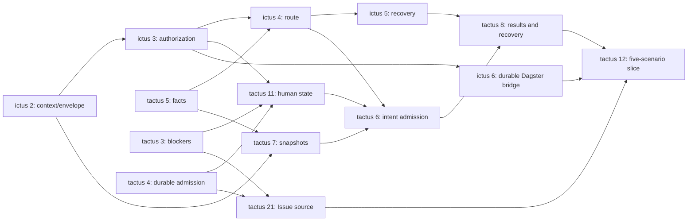

# Shared GitHub roadmap — Architecture Baseline v1

GitHub Issues are canonical shared implementation intent. This is a navigation
snapshot from 2026-10-06; current bodies, labels and native GitHub dependencies
are authoritative for execution planning. Acceptance criteria live in the Issues.

The operator merged [Tactus baseline PR #19](https://github.com/Walsamer/tactus/pull/19)
and [Ictus baseline PR #1](https://github.com/Walsamer/ictus/pull/1). Existing Tactus
Issues #1 and #2 remain completed. No redundant baseline implementation issue was
created. The old milestone 1 was renamed M2 to retain its identity and history.

`area:*` labels reuse the existing component vocabulary. Every active objective
has one component, type, priority, milestone and Fleet-status label. Native
blocked-by edges match the full Issue URLs in each Dependencies section.

## M0 — Architecture Convergence

| Issue | Title | Priority | Fleet status | Implementation dependencies |
|---|---|---|---|---|
| [tactus#20](https://github.com/Walsamer/tactus/issues/20) | Gate current Fleet GitHub intake on fleet:ready and immutable Issue revisions | p0 | fleet:human | None |

## M1 — Control / Decision Boundary

| Issue | Title | Priority | Fleet status | Implementation dependencies |
|---|---|---|---|---|
| [tactus#3](https://github.com/Walsamer/tactus/issues/3) | Add typed WorkOrder blockers and independent unblock semantics | p0 | fleet:blocked | None |
| [tactus#4](https://github.com/Walsamer/tactus/issues/4) | Persist fenced WorkOrder claims, attempts and execution handoff | p0 | fleet:blocked | None |
| [tactus#5](https://github.com/Walsamer/tactus/issues/5) | Expose versioned backend descriptors, health and quota facts to Ictus | p0 | fleet:human | None |
| [ictus#2](https://github.com/Walsamer/ictus/issues/2) | Version initial/recovery context and validated decision contracts for Tactus | p0 | fleet:blocked | None |
| [ictus#3](https://github.com/Walsamer/ictus/issues/3) | Validate capability and approval grants before emitting executable intents | p0 | fleet:blocked | [ictus#2](https://github.com/Walsamer/ictus/issues/2) |
| [ictus#4](https://github.com/Walsamer/ictus/issues/4) | Select compatible backend and model routes from observed facts | p0 | fleet:blocked | [ictus#2](https://github.com/Walsamer/ictus/issues/2), [ictus#3](https://github.com/Walsamer/ictus/issues/3), [tactus#5](https://github.com/Walsamer/tactus/issues/5) |
| [ictus#5](https://github.com/Walsamer/ictus/issues/5) | Produce bounded semantic RecoveryDecisions from normalized observations | p0 | fleet:blocked | [ictus#2](https://github.com/Walsamer/ictus/issues/2), [ictus#3](https://github.com/Walsamer/ictus/issues/3), [ictus#4](https://github.com/Walsamer/ictus/issues/4) |
| [tactus#7](https://github.com/Walsamer/tactus/issues/7) | Build versioned initial and recovery StateSnapshots for Ictus | p0 | fleet:blocked | [ictus#2](https://github.com/Walsamer/ictus/issues/2), [tactus#5](https://github.com/Walsamer/tactus/issues/5) |
| [tactus#11](https://github.com/Walsamer/tactus/issues/11) | Persist human intervention and revision-bound approval resolutions | p0 | fleet:blocked | [tactus#3](https://github.com/Walsamer/tactus/issues/3), [tactus#4](https://github.com/Walsamer/tactus/issues/4), [ictus#3](https://github.com/Walsamer/ictus/issues/3) |
| [tactus#6](https://github.com/Walsamer/tactus/issues/6) | Admit validated ExecutionIntents and revalidate the selected route | p0 | fleet:blocked | [tactus#3](https://github.com/Walsamer/tactus/issues/3), [tactus#4](https://github.com/Walsamer/tactus/issues/4), [tactus#7](https://github.com/Walsamer/tactus/issues/7), [tactus#11](https://github.com/Walsamer/tactus/issues/11), [ictus#4](https://github.com/Walsamer/ictus/issues/4) |
| [tactus#8](https://github.com/Walsamer/tactus/issues/8) | Apply validated RecoveryDecisions and verified outcomes transactionally | p0 | fleet:blocked | [tactus#6](https://github.com/Walsamer/tactus/issues/6), [ictus#5](https://github.com/Walsamer/ictus/issues/5) |

## M2 — Minimal Vertical Slice

| Issue | Title | Priority | Fleet status | Implementation dependencies |
|---|---|---|---|---|
| [ictus#6](https://github.com/Walsamer/ictus/issues/6) | Add durable Dagster submission, receipt reconciliation and result delivery | p0 | fleet:blocked | [ictus#2](https://github.com/Walsamer/ictus/issues/2), [ictus#3](https://github.com/Walsamer/ictus/issues/3) |
| [tactus#21](https://github.com/Walsamer/tactus/issues/21) | Ingest a checked GitHub Issue revision into a Tactus WorkOrder | p0 | fleet:blocked | [tactus#4](https://github.com/Walsamer/tactus/issues/4), [tactus#3](https://github.com/Walsamer/tactus/issues/3) |
| [tactus#12](https://github.com/Walsamer/tactus/issues/12) | Prove the five-scenario Issue to Tactus–Ictus–Dagster vertical slice | p0 | fleet:blocked | [tactus#8](https://github.com/Walsamer/tactus/issues/8), [tactus#21](https://github.com/Walsamer/tactus/issues/21), [ictus#6](https://github.com/Walsamer/ictus/issues/6) |

## M3 — Runtime + Development Workflow

| Issue | Title | Priority | Fleet status | Implementation dependencies |
|---|---|---|---|---|
| [tactus#10](https://github.com/Walsamer/tactus/issues/10) | Materialize validated split/replan children and dependency rewrites atomically | p1 | fleet:blocked | [tactus#8](https://github.com/Walsamer/tactus/issues/8), [ictus#5](https://github.com/Walsamer/ictus/issues/5) |
| [tactus#22](https://github.com/Walsamer/tactus/issues/22) | Integrate one bounded local coding-agent runtime | p1 | fleet:blocked | [tactus#12](https://github.com/Walsamer/tactus/issues/12) |
| [tactus#23](https://github.com/Walsamer/tactus/issues/23) | Add Stax workspace and authorized branch/PR publication workflow | p1 | fleet:blocked | [tactus#12](https://github.com/Walsamer/tactus/issues/12) |

## M4 — Fleet Migration

| Issue | Title | Priority | Fleet status | Implementation dependencies |
|---|---|---|---|---|
| [tactus#24](https://github.com/Walsamer/tactus/issues/24) | Migrate Fleet responsibilities through shadowing and reversible authority transfer | p1 | fleet:blocked | [tactus#20](https://github.com/Walsamer/tactus/issues/20), [tactus#12](https://github.com/Walsamer/tactus/issues/12), [tactus#22](https://github.com/Walsamer/tactus/issues/22), [tactus#23](https://github.com/Walsamer/tactus/issues/23), [tactus#10](https://github.com/Walsamer/tactus/issues/10) |

## M5 — Production Hardening

| Issue | Title | Priority | Fleet status | Implementation dependencies |
|---|---|---|---|---|
| [tactus#25](https://github.com/Walsamer/tactus/issues/25) | Harden execution reconciliation, operational limits and server portability | p2 | fleet:blocked | [tactus#24](https://github.com/Walsamer/tactus/issues/24) |

## Fleet starting queue

**Currently empty: zero issues are labeled `fleet:ready`.** Baseline review is
complete. The remaining global gate is [Tactus #20](https://github.com/Walsamer/tactus/issues/20):
current Fleet must enforce fleet:ready, preserve source revisions and recheck
freshness; Ictus project mapping/configuration must be reviewed before enablement.
No Fleet runtime/configuration was changed by this baseline/backlog work.

After #20 is completed and its rollout verified, the proposed first authorization
batch is exactly:

1. [Tactus #3](https://github.com/Walsamer/tactus/issues/3) — typed blockers.
2. [Ictus #2](https://github.com/Walsamer/ictus/issues/2) — generic integration contracts.

Those two can execute independently, after a fresh operator readiness review.
Next consider Tactus #4 and Ictus #3; do not mark every milestone ready. Marking
fleet:ready is a future deliberate action, not authorization conveyed by this list.

## Human parallel work

- [Tactus #20](https://github.com/Walsamer/tactus/issues/20): current Fleet intake
  work in the Fleet repository; explicitly human-owned and separate from Tactus code.
- [Tactus #5](https://github.com/Walsamer/tactus/issues/5): backend fact contract
  in Tactus; independent of initial blocker and generic Ictus contract work.
- After M2, Stax #23 and runtime #22 can develop against fake ports on separate
  branches; coordinate shared composition files before integrating.

## Vertical-slice critical path

The first successful execution flows through #21 → #7 → Ictus #2/#3/#4 →
Tactus #6/#4 → Ictus #6 → simple local subprocess → Tactus #8.
Tactus #12 also proves recovery, human intervention and restart behavior.
Stax, real agents, decomposition and optional lineage are later capabilities.
