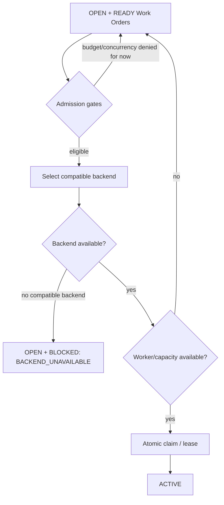
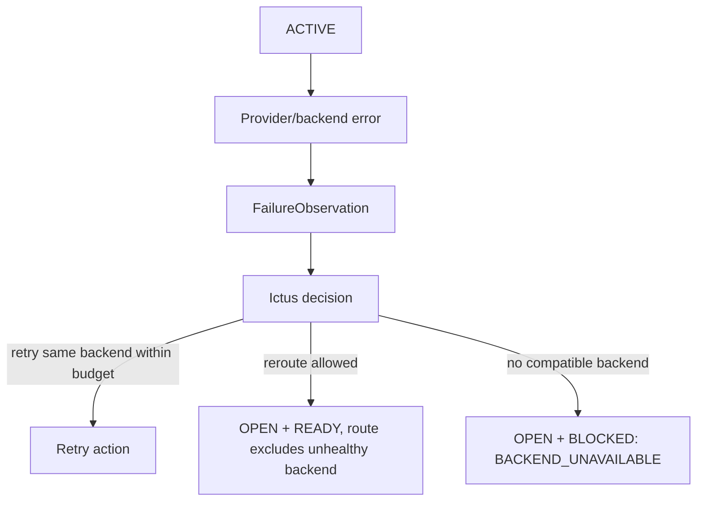

# Scheduling and Backend Availability

## Purpose

The scheduler decides **which `OPEN + READY` Work Order may run now**. It does not decide how a failed run should be repaired; recovery belongs to the Ictus/Tactus triage flow.

The whiteboard separates three questions:

1. Is this Work Order eligible to run?
2. Is a compatible backend available?
3. Is worker/capacity available right now?

These must remain distinct.

## Scheduler flow



The `READY` and `BLOCKED` nodes are readiness statuses of the `OPEN` lifecycle
state, not peer lifecycle states.

## Admission gates

The sketch calls out system-level constraints around scheduling. Initial gates should include:

- global concurrency;
- per-project concurrency;
- configured resource-pool capacity;
- daily/global runaway budget guard;
- backend/model-specific budget where applicable;
- explicit project/system pause state;
- dependency readiness recheck at claim time.

These are eligibility gates, not triage decisions.

## Backend selection

Backend selection should be based on an explicit compatibility/routing contract rather than hard-coded conditionals throughout the scheduler.

A backend candidate can be evaluated on dimensions such as:

```text
required capability
agent/runtime compatibility
model/provider compatibility
project policy
cost/budget policy
current health/availability
current capacity
```

The scheduler should ask a backend registry/router for compatible candidates and select only among currently admissible candidates.

## Backend availability vs worker availability

This distinction from the whiteboard is important:

### Backend unavailable

Examples:

- provider outage;
- authentication/service failure;
- API unavailable;
- usage/quota limit with no usable route;
- backend health explicitly disabled.

If no compatible backend remains:

```text
OPEN + READY → OPEN + BLOCKED(reason=BACKEND_UNAVAILABLE)
```

This is a readiness change within `OPEN`, not a lifecycle transition.

### Worker/capacity unavailable

Examples:

- all worker slots busy;
- project concurrency cap reached;
- temporary pool saturation.

The Work Order remains:

```text
OPEN + READY
```

No block record should be created merely because capacity is currently busy.

## Backend status model

Tactus observes backend status independently from individual Work Orders.
Status is factual, volatile system state, kept separate from capacity and
quota.

Status vocabulary (v1):

```text
AVAILABLE
UNAVAILABLE
DISABLED
```

- `AVAILABLE` — operational.
- `UNAVAILABLE` — currently not operational; must not receive work.
- `DISABLED` — administratively excluded until explicitly re-enabled or
  superseded.

Status observations may include:

- connectivity/probe status;
- recent API/provider failures;
- quota/usage state;
- rate-limit state;
- operator disablement;
- time of last successful execution.

A status observation must have a timestamp and expires at query time. A missing
or expired observation means "no fresh authoritative status known", which is
**not** `UNAVAILABLE`. Observations that must stay in force until explicitly
superseded (for example an operator `DISABLED`) simply carry no expiry; there is
no default TTL, because different producers have different freshness semantics.

Capacity (concurrency/slots) and quota (tokens/rate limits/budget) are tracked
separately from status. A backend that is `AVAILABLE` with zero free capacity is
*busy*, not unavailable, and does not block a Work Order.

## Implementation

Backend facts live in `src/tactus/backends/`:

- `registry.py` — `BackendId`, `BackendDescriptor`, `BackendRequirements`,
  `EffortLevel`, `BackendRegistry` (mechanically pure compatibility matching);
- `health.py` — `BackendHealth`, `BackendStatusObservation`,
  `BackendHealthModel` (latest-wins, query-time expiry);
- `capacity.py` — `Capacity`, `CapacityView`.

These modules own facts only. Ranking, preference and backend/model/effort
selection belong to the decision plane and are applied later.

## Backend failure during ACTIVE execution

When an active execution indicates backend failure, the result should be normalized into an execution observation and sent through decision policy.

Conceptual flow:



The Work Order remains `ACTIVE` while the observation is recorded and triaged.

Do not directly mutate an ACTIVE Work Order to a different backend in-place. End the current attempt, record the observation, and create a new scheduling decision/attempt.

## API timeout / quota pattern

The sketch distinguishes backend API timeout and usage/quota exhaustion.

Recommended normalized behavior:

### API timeout

1. Allow at most a very small same-attempt/same-backend retry if policy explicitly permits it.
2. Repeated timeout marks/degrades the backend health observation.
3. Requeue the Work Order to `OPEN + READY` for fresh routing if another compatible backend may exist.
4. If no compatible backend is available, block as `BACKEND_UNAVAILABLE`.

### Usage/quota limit

1. Mark that backend unavailable for the relevant capability/window.
2. Requeue for another compatible backend if one exists.
3. Otherwise block as `BACKEND_UNAVAILABLE` until backend health changes.

## Unblocking

A backend-health change can unblock affected Work Orders:

```text
backend becomes AVAILABLE
        ↓
find OPEN + BLOCKED WOs with reason BACKEND_UNAVAILABLE
        ↓
re-evaluate compatibility and all readiness gates
        ↓
READY if runnable; otherwise remain BLOCKED for the remaining reason
```

Do not bulk-force all blocked work to `OPEN + READY` without re-evaluating other prerequisites.
