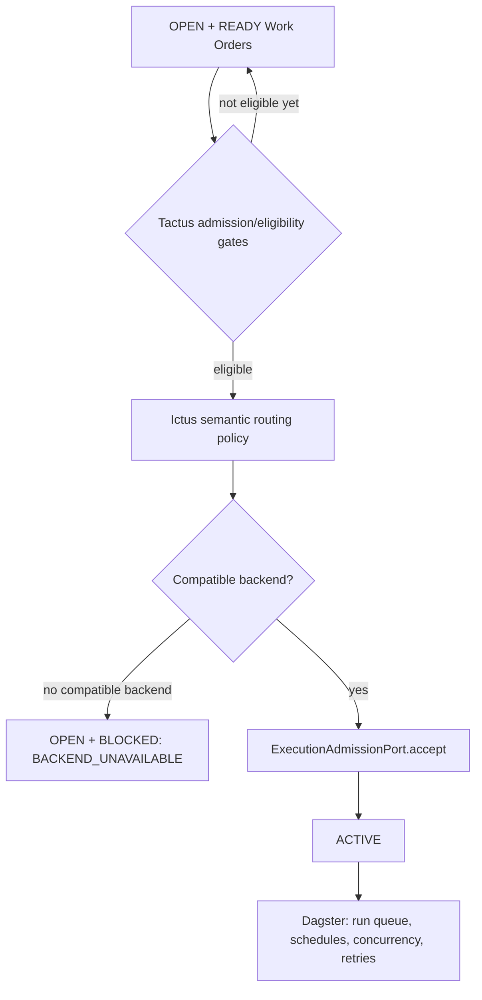
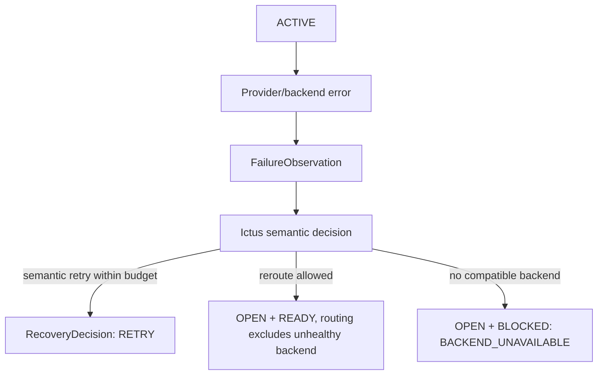

# Admission, Backend Routing, and Execution Handoff

## Purpose

Tactus decides **whether an `OPEN + READY` Work Order is eligible to be handed
to execution**. It does **not** own a queue, scheduler, schedule/sensors or
execution loop: those are Dagster's. Selecting *which* backend is semantically
appropriate is Ictus policy, not Tactus logic.

This document distinguishes three questions that must never be collapsed:

1. Is this Work Order eligible for execution? → **Tactus admission/eligibility**.
2. Which compatible backend should it use? → **Ictus semantic routing policy**.
3. When does it actually run, and with what concurrency/retries? →
   **Dagster temporal execution**.

## Canonical ownership table

```text
Tactus
= WorkOrder/domain lifecycle
= domain dependencies/readiness
= admission/eligibility
= domain facts/context
= application of validated semantic decisions
= human/domain coordination

Ictus
= semantic decision making
= policy
= capability validation
= semantic routing
= recovery strategy

Dagster
= temporal/durable execution
= workflow graph
= run/step state
= schedules
= sensors/events
= run queue
= execution concurrency
= retries
= re-execution
= execution history
= execution observability
```

Load-bearing distinctions:

```text
domain dependency      ≠ Dagster step dependency
domain readiness       ≠ execution scheduling
semantic retry         ≠ Dagster RetryPolicy
backend routing policy ≠ Dagster worker scheduling
ACTIVE                 ≠ "CPU currently running"
```

**Tactus must never become a workflow engine, run queue, temporal scheduler or
retry engine.** Dagster is authoritative over temporal execution state. Ictus is
authoritative over semantic recovery/routing decisions. Tactus is authoritative
over WorkOrder/domain state.

## `WorkOrder.ACTIVE` semantic

> `WorkOrder.ACTIVE` means an authoritative execution attempt exists / has been
> accepted for execution. It does **not** mirror Dagster's internal
> queued/running step state.

Accepting an execution attempt is a Tactus domain-lifecycle event. Whether
Dagster has queued, started, retried, or finished the corresponding run is
separate temporal execution state owned by Dagster.

## Execution admission port (`ExecutionAdmissionPort`)

### Name choice

The bounded boundary name is **`ExecutionAdmissionPort`**. It was chosen
over the two other candidates deliberately:

- `ExecutionRequestPort` describes only receiving a request and hides the
  eligibility half of the boundary;
- `LaunchPort` implies Tactus launches execution, which is Dagster's job.

`ExecutionAdmissionPort` matches the corrected issue #4 wording ("admission/
eligibility port and execution-attempt acceptance contract") and the
admission/eligibility vocabulary used throughout this document. It is a
**domain admission port**, not a scheduler.

### Contract

The port and its value objects live in `src/tactus/domain/admission.py`.

Inputs:

- an `OPEN` Work Order and its readiness (`UNKNOWN | READY | BLOCKED`);
- `AdmissionFacts` — domain facts owned by other subsystems and consumed as
  inputs, never recomputed by this boundary: `dependencies_satisfied`,
  `capabilities_present`, `system_paused`, `budget_available`;
- an `ExecutionRequest` — a validated Ictus `ExecutionIntentId` plus the opaque
  `DagsterRunId` supplied by the execution plane. Passing the request is the
  evidence that Ictus authorized this execution; Tactus embeds no routing,
  ranking or recovery policy.

Outputs:

- `AdmissionDecision` — `eligible` plus a human-readable `reason`;
- `ExecutionAttempt` — the atomic correlation value
  `WorkOrderId -> ExecutionIntentId -> DagsterRunId`, created only on
  acceptance.

| Operation | Answers |
|---|---|
| `evaluate(work_order, facts=...)` | Is this Work Order currently domain-eligible? |
| `accept(work_order, request, ...)` | Atomically accept the request and create the attempt correlation |
| `active_attempt(work_order_id)` | The current authoritative attempt, if any |
| `attempt_for_intent(intent_id)` / `attempt_for_dagster_run(run_id)` | Correlation round-trip lookups |
| `close_attempt(attempt_id)` | Conclude an attempt's correlation (bookkeeping only; no recovery decision) |

### Allowed and forbidden questions

The port answers only **domain/authorization** questions:

- is this Work Order still `OPEN + READY`?
- are its domain dependencies and configured eligibility gates satisfied?
- is an Ictus-validated execution intent present?
- can the execution-attempt correlation be created atomically?

It must **not** answer Dagster questions:

- which worker slot is free / which queued run gets capacity next?
- when should a queued execution start / when should a step retry?
- how are run queues persisted?

There is no `READY` polling loop, no run queue, no worker selection, no
slot/concurrency accounting and no retry engine in this boundary. Domain
readiness is not execution scheduling.

### Atomic invariant

```text
OPEN + READY
    -> create authoritative execution-attempt correlation
    -> ACTIVE
```

`ExecutionAdmission.accept()` performs the whole transition as one operation: it
validates the request and rejects duplicates *before* mutating anything, then
performs the lifecycle transition and only afterwards records the correlation.
On failure the Work Order and the correlation ledger are left unchanged.

Duplicate-execution protection is enforced on three keys: a Work Order may have
at most one active attempt, and an `ExecutionIntentId` or `DagsterRunId` may be
correlated at most once (including concluded attempts, so ids are never
recycled).

### Correlation value

`ExecutionAttempt` stores `attempt_id`, `work_order_id`, `intent_id`,
`dagster_run_id` and `accepted_at` — and nothing else. `DagsterRunId` is an
opaque handle: Tactus never validates its format, parses it, or mirrors any
Dagster run/step state. Dagster remains authoritative over whether the run is
queued, running, retried or finished.

## Admission and handoff flow



The `READY` and `BLOCKED` nodes are readiness statuses of the `OPEN` lifecycle
state, not peer lifecycle states.

Once Tactus accepts the execution attempt the Work Order is `ACTIVE`; Dagster
then owns queuing and running it. Dagster queue depth or worker saturation never
rewrites the Work Order's readiness.

## Admission gates (Tactus)

The sketch calls out system-level constraints around execution. Under the frozen
ownership split these are **eligibility** gates over domain work, not execution
scheduling decisions:

- domain dependency readiness recheck at acceptance time;
- required-capability presence for the Work Order;
- policy eligibility as validated by Ictus;
- explicit project/system pause state;
- configured runaway budget guard.

Execution concurrency, run ordering, schedules and sensors belong to Dagster and
must not be implemented as Tactus admission gates.

## Backend routing (Ictus)

Which backend a Work Order should use is a **semantic routing policy** decision
owned by Ictus. Tactus asks for and applies the validated routing decision; it
does not hard-code backend selection heuristics throughout the scheduler.

Routing inputs may include:

```text
required capability
agent/runtime compatibility
model/provider compatibility
project policy
cost/budget policy
current backend health/availability (domain context recorded by Tactus)
```

Tactus may record backend availability observations as domain facts/context, but
routing policy lives in Ictus and execution scheduling lives in Dagster.

## Backend unavailable vs execution concurrency unavailable

This distinction is important and must not be collapsed.

### Backend unavailable

Examples:

- provider outage;
- authentication/service failure;
- API unavailable;
- usage/quota limit with no usable route;
- backend health explicitly disabled.

If Ictus routing yields no compatible backend:

```text
OPEN + READY → OPEN + BLOCKED(reason=BACKEND_UNAVAILABLE)
```

This is a readiness change within `OPEN`, not a lifecycle transition.

### Execution concurrency unavailable

Execution concurrency, worker slots and run ordering are **Dagster-owned**. A
Work Order whose accepted attempt is waiting in Dagster's run queue is already
`ACTIVE`; it must not be reclassified as `OPEN + READY` or blocked because a
worker slot is busy. Tactus does not expose Dagster's queue state as Work Order
readiness.

## Backend health model

Tactus may observe and record backend health as domain context that Ictus
routing consults. Initial health vocabulary can remain small:

```text
AVAILABLE
DEGRADED
UNAVAILABLE
DISABLED
```

Health observations may include:

- connectivity/probe status;
- recent API/provider failures;
- quota/usage state;
- rate-limit state;
- operator disablement;
- time of last successful execution.

A backend health observation must have a timestamp and should decay/expire
rather than remaining authoritative forever. Backend health is **not** temporal
execution state and does not mirror Dagster's internal run/step state.

## Backend failure during ACTIVE execution

When an active execution indicates backend failure, the result should be
normalized into an observation and sent through Ictus semantic decision policy.

Conceptual flow:



The Work Order remains `ACTIVE` while the observation is recorded and triaged.

A semantic retry/reroute decision is **not** a Dagster `RetryPolicy`. Dagster may
additionally apply its own execution-level retry mechanics to an individual run;
that is execution state, not Work Order recovery state.

Do not directly mutate an `ACTIVE` Work Order to a different backend in-place.
End the current attempt, record the observation, and let Ictus produce a new
validated routing decision that Tactus applies as a new attempt.

## API timeout / quota pattern

The sketch distinguishes backend API timeout and usage/quota exhaustion.
Normalized behavior under the ownership split:

### API timeout

1. Allow at most a very small same-attempt/same-backend execution retry if
   Dagster policy explicitly permits it.
2. Repeated timeout marks/degrades the backend health observation.
3. Ictus may decide a semantic requeue/reroute; Tactus applies it to `OPEN +
   READY` for fresh routing if another compatible backend may exist.
4. If no compatible backend is available, block as `BACKEND_UNAVAILABLE`.

### Usage/quota limit

1. Mark that backend unavailable for the relevant capability/window.
2. Ictus may decide a reroute; Tactus applies it for another compatible backend
   if one exists.
3. Otherwise block as `BACKEND_UNAVAILABLE` until backend health changes.

## Unblocking

A backend-health change can unblock affected Work Orders:

```text
backend becomes AVAILABLE
        ↓
find OPEN + BLOCKED WOs with reason BACKEND_UNAVAILABLE
        ↓
re-evaluate routing and all eligibility gates
        ↓
READY if eligible; otherwise remain BLOCKED for the remaining reason
```

Do not bulk-force all blocked work to `OPEN + READY` without re-evaluating other
prerequisites.
