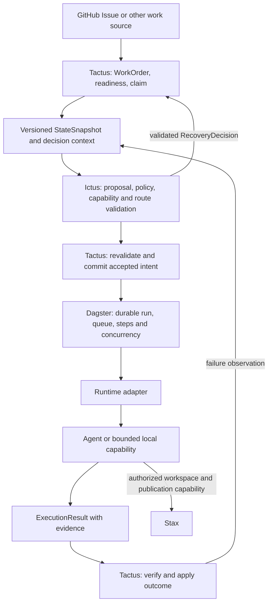

# Architecture Baseline v1

Normative design, 2026-10-06. This baseline records the operator's specified
responsibility split. The architecture PRs review its repository adoption;
they do not assert that the target system is already implemented.

## Authority and navigation

This document and the six linked specifications below are the canonical system
baseline. They supersede earlier whiteboard translations, corrective backlogs
and session plans. Ictus owns its generic wire schemas and implementation;
schema changes require explicit versioning. Current code is implementation
evidence, not an exception to these ownership rules.

- [Ownership boundaries](OWNERSHIP_BOUNDARIES.md)
- [WorkOrder state model](WORK_ORDER_STATE_MODEL.md)
- [Cross-system contracts](CROSS_SYSTEM_CONTRACTS.md)
- [Execution and recovery](EXECUTION_AND_RECOVERY.md)
- [Local first runtime](LOCAL_FIRST_RUNTIME.md)
- [Migration and Issue → Fleet contract](MIGRATION_FROM_FLEET.md)
- [Implementation and backlog reconciliation](BASELINE_V1_RECONCILIATION.md)

GitHub Issues are the shared implementation plan. Fleet WorkOrders are bounded
execution units derived from those issues; they are not a competing roadmap.

## System composition

Agent reasons and edits. Dagster executes durably. Ictus decides. Tactus governs
the work. These are logical boundaries; they do not require separate servers.

Tactus is the composition repository and Python domain application. Ictus is
an independently versioned Rust decision core with a Python Dagster bridge.
Do not copy one repository's implementation into the other. Dagster is a pinned
execution dependency. Runtime, agent and Stax integrations stay behind ports.
Metaxy is optional artifact/data lineage; it does not own WorkOrder dependencies
or the general domain audit log. Pixi and richer runtimes are optional bootstrap
choices, not prerequisites for the first proof.

## First useful proof

M2 proves Issue → WorkOrder → context → Ictus → intent → persistent Dagster →
simple local process → result → Tactus, including success, step retry, semantic
recovery, human escalation and restart without duplicate unsafe effects.
No Pi, SoL-Pi, OpenShell, Stax, Metaxy or Kubernetes prerequisite is imposed on
that proof. M3 adds real coding-agent and Stax change/PR workflows.

## Current evidence

Tactus main has the lifecycle, dependency graph, in-memory admission, backend
facts and observation/snapshot adapters. It has no durable end-to-end service.
Ictus main has generic schemas, deterministic policy, three domain examples,
a stdio bridge and persistent Dagster demos. Its synchronous in-process bridge
does not prove a queued, independently launched, restart-safe handoff.
Integration-only generic vocabulary and decision application are useful pending
work, not merged capabilities. See reconciliation for exact refs and gaps.
