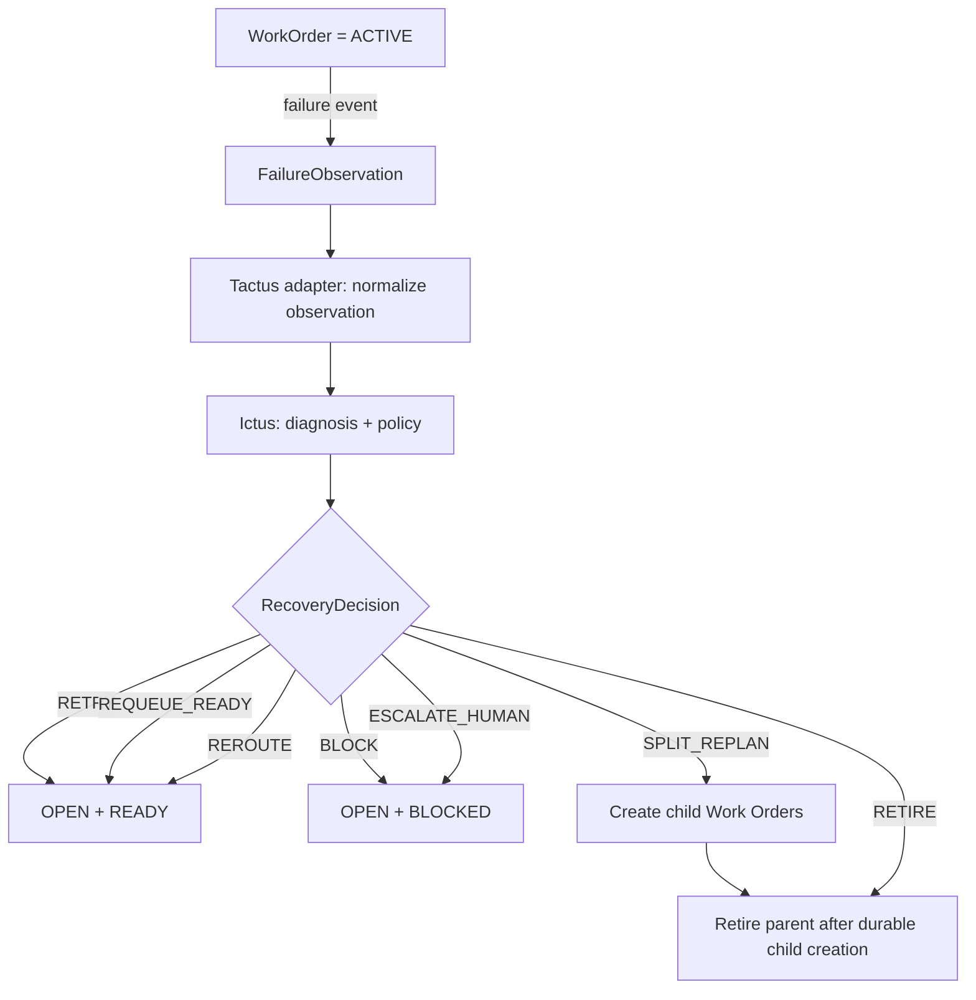
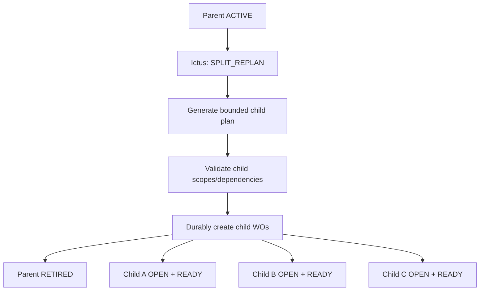

# Triage and Recovery

## Purpose

Triage converts an execution failure/observation into a **diagnosis plus a typed recovery decision**.

The whiteboard explicitly separates:

```text
Diagnosis + Decision + optional additional action/trigger
```

That separation should be preserved.

Tactus records and applies lifecycle state. Ictus owns the typed decision/policy layer. Dagster executes validated recovery work where durable execution is needed.

A failure is an **observation**, not a lifecycle state. While a failure is being
observed, classified, and triaged, the Work Order remains `ACTIVE`. Only when
Tactus applies the validated `RecoveryDecision` does the lifecycle state change
(or readiness change within `OPEN`).

Canonical ownership table:

```text
Tactus
= WorkOrder/domain lifecycle
= domain dependencies/readiness
= admission/eligibility
= domain facts/context
= application of validated semantic decisions
= human/domain coordination

Ictus
= semantic decision making
= policy
= capability validation
= semantic routing
= recovery strategy

Dagster
= temporal/durable execution
= workflow graph
= run/step state
= schedules
= sensors/events
= run queue
= execution concurrency
= retries
= re-execution
= execution history
= execution observability
```

Load-bearing distinctions:

```text
domain dependency      ≠ Dagster step dependency
domain readiness       ≠ execution scheduling
semantic retry         ≠ Dagster RetryPolicy
backend routing policy ≠ Dagster worker scheduling
ACTIVE                 ≠ "CPU currently running"
```

**Tactus must never become a workflow engine, run queue, temporal scheduler or
retry engine.** Dagster is authoritative over temporal execution state. Ictus is
authoritative over semantic recovery/routing decisions. Tactus is authoritative
over WorkOrder/domain state.

Normative `WorkOrder.ACTIVE` semantic:

> `WorkOrder.ACTIVE` means an authoritative execution attempt exists / has been
> accepted for execution. It does **not** mirror Dagster's internal
> queued/running step state.

This is normative:

```text
Tactus
- sole authority over WorkOrder/domain lifecycle state
- records/normalizes FailureObservations as domain facts
- applies validated semantic RecoveryDecisions
- owns no run queue, scheduler, execution concurrency or retry engine

Ictus
- owns diagnosis, policy, semantic routing and typed RecoveryDecisions
- authoritative over semantic recovery/routing decisions
- consumes normalized observations from Tactus
- does NOT directly mutate WorkOrder state

Dagster
- owns temporal/durable execution mechanics and temporal execution state
- owns execution-level retries (`RetryPolicy`), concurrency and run state
- reports execution outcomes/errors
- does NOT own or mutate Tactus WorkOrder state
```

## Recovery model



The Work Order remains `ACTIVE` while the `FailureObservation` is created and
triaged. The decision does not invent new lifecycle states. It selects an action
that leads to an existing lifecycle state (`OPEN` or `RETIRED`), and within
`OPEN` Tactus re-evaluates readiness (`READY`/`BLOCKED`).

A recovery `RecoveryDecision` never produces `IMPLEMENTED`. Successful
completion is the independent direct path `ACTIVE → IMPLEMENTED` and does not
pass through Ictus recovery.

## Initial diagnosis taxonomy

The sketch suggests the following useful categories. Names below are normalized and may be refined, but should remain typed rather than free-form strings.

```text
TRANSIENT_RUNTIME_FAILURE
PROVIDER_API_TIMEOUT
PROVIDER_UNAVAILABLE
PROVIDER_QUOTA_EXHAUSTED
WORKER_TIMEOUT
EXECUTION_TIMEOUT
SCOPE_VIOLATION
DEPENDENCY_UNAVAILABLE
DEPENDENCY_RESOLVED
TASK_TOO_COMPLEX_SPLITTABLE
TASK_TOO_COMPLEX_NOT_SPLITTABLE
REQUEST_INVALID_OR_SUPERSEDED
VERIFICATION_FAILURE
INTEGRATION_FAILURE
UNKNOWN
```

Do not encode backend/provider-specific product names in the core taxonomy.

## Initial recovery actions

```text
RETRY
REQUEUE_READY
REROUTE
BLOCK
ESCALATE_HUMAN
SPLIT_REPLAN
RETIRE
NO_ACTION
```

This closed vocabulary is authoritative. A bounded in-scope repair step, if it is
ever needed, is a future capability or structured parameter/work item — not a
top-level recovery action — unless a later architecture decision introduces one.

An action may carry structured parameters, for example:

```yaml
action: REQUEUE_READY
reason: PROVIDER_API_TIMEOUT
exclude_backend: backend-x
retry_budget_consumed: 1
```

or:

```yaml
action: SPLIT_REPLAN
reason: TASK_TOO_COMPLEX_SPLITTABLE
strategy: smaller_independent_children
```

## Suggested initial decision table

This table captures the intent of the whiteboard without freezing implementation-specific retry counts prematurely.

| Diagnosis | Default decision | Result (lifecycle + readiness) | Additional effect |
|---|---|---|---|
| transient runtime failure | `RETRY` or `REQUEUE_READY` | `OPEN + READY` | consume bounded retry budget |
| provider API timeout | `RETRY` once if allowed, then `REROUTE`/`REQUEUE_READY` | `OPEN + READY` | degrade backend health |
| provider unavailable | `REROUTE` if alternate exists, otherwise `BLOCK` | `OPEN + READY` or `OPEN + BLOCKED` | backend-health update |
| provider quota exhausted | `REROUTE` if alternate exists, otherwise `BLOCK` | `OPEN + READY` or `OPEN + BLOCKED` | backend unavailable until window changes |
| dependency unavailable | `BLOCK` | `OPEN + BLOCKED` | wait for dependency event |
| dependency resolved | `REQUEUE_READY` | `OPEN + READY` | re-evaluate readiness |
| task too complex, splittable | `SPLIT_REPLAN` | parent `RETIRED` after split | create smaller child WOs |
| task too complex, not safely splittable | `ESCALATE_HUMAN` | `OPEN + BLOCKED` | human intervention request |
| worker/execution timeout | `REQUEUE_READY` within budget | `OPEN + READY` | consume retry budget; escalate when exhausted |
| scope violation | normally `ESCALATE_HUMAN` or constrained replan | `OPEN + BLOCKED` / `OPEN + READY` | never silently widen scope |
| request invalid/superseded | `RETIRE` | `RETIRED` | preserve reason/evidence |
| integration failure | `ESCALATE_HUMAN`; any bounded in-scope repair would be a future structured capability, not a top-level action | `OPEN + BLOCKED` | preserve verification evidence, never widen scope silently |
| unknown | conservative `ESCALATE_HUMAN` | `OPEN + BLOCKED` | no speculative widening |

## Bounded retry policy

Retries must be explicitly budgeted. These are **semantic** retries: Ictus
policy decisions that create new execution attempts. They are distinct from a
Dagster `RetryPolicy`, which governs execution-level retries of an individual run
inside the execution plane.

At minimum distinguish:

- same-attempt micro-retry, if any;
- new execution attempt on the same backend;
- reroute to a different backend;
- Work Order-level recovery budget.

A repeated failure must eventually change strategy:

```text
retry → requeue/reroute → split/replan or human escalation
```

Never allow an unbounded loop where the same diagnosis repeatedly returns the Work Order to `OPEN + READY` without consuming a budget or changing conditions.

## Split and replan

Split/replan is a recovery action for work that is too large/complex but can be decomposed safely.



Rules:

- child WOs inherit provenance from the parent;
- child scopes must not silently exceed parent authorization;
- dependencies among children must be explicit;
- the parent is retired only after child creation succeeds durably (the parent
  remains `ACTIVE` until then);
- failure to split safely escalates rather than widening scope.

## Triage trigger vs admission and execution triggers

Keep these separate:

- Tactus admission/eligibility decides **whether an `OPEN + READY` Work Order is
  eligible for execution**.
- Ictus semantic routing decides **which backend** an eligible Work Order should
  use.
- Dagster decides **when/with what concurrency a run actually executes**.
- Triage decides **what should happen after an observation/failure**.

A backend-health observation may affect several of these, but through different
interfaces:

```text
failure → Ictus semantic recovery decision
backend health update → routing eligibility (Ictus), recorded by Tactus as domain context
```
