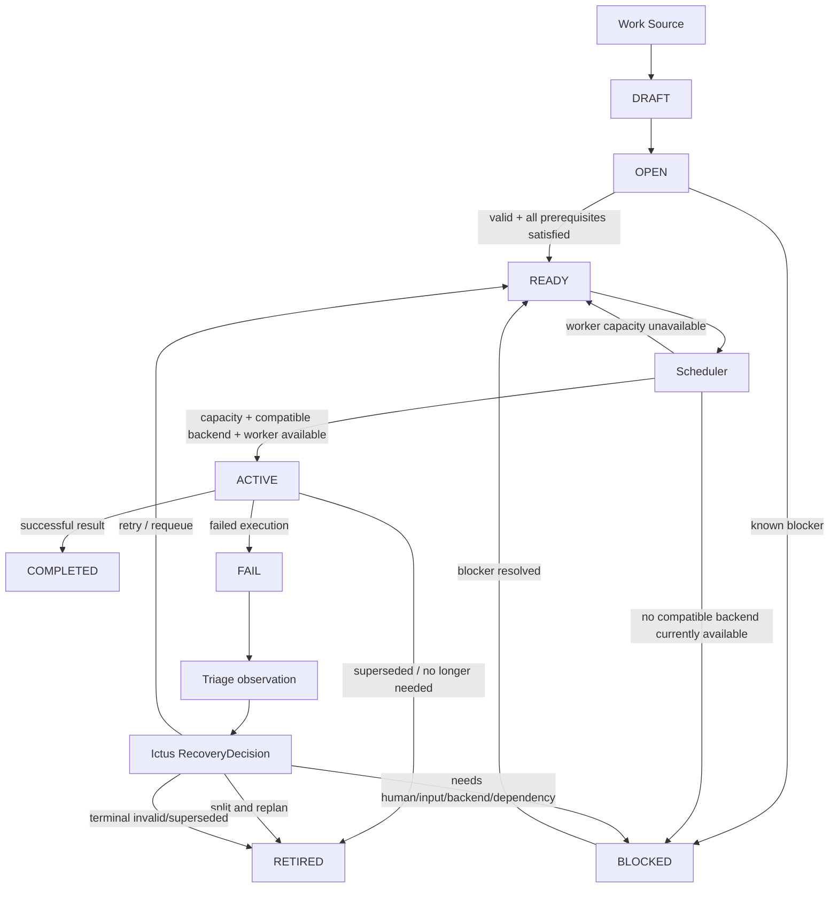

# Tactus Control-Plane Architecture — Whiteboard Translation

This document translates the current hand-drawn Fleet/Tactus control-plane design into a versioned architecture description. It is a design source of truth, not an implementation claim.

The sketch focuses on five connected concerns:

1. Work Order lifecycle and state ownership.
2. Blocking and unblocking.
3. Scheduler, backend selection, and capacity.
4. Triage and recovery decisions after failures.
5. Human intervention for cases automation cannot resolve safely.

The design must remain consistent with the wider Tactus architecture:

```text
CONTROL PLANE
Tactus
   ↓
DECISION PLANE
Ictus
   ↓
EXECUTION / PROVENANCE PLANE
Dagster + Metaxy
   ↓
RUNTIME / SANDBOX PLANE
SandboxRuntime       AgentRuntime
OpenShell / ...      Pi / SoL-Pi / ...
   ↓
CAPABILITIES
Git + Stax
shell / tests / build / deploy / ...
```

## Responsibility split

### Tactus

Tactus owns operational coordination:

- Work Order identity and lifecycle state;
- admission from work sources;
- dependency readiness;
- blocked/unblocked state;
- scheduler eligibility;
- concurrency and budget gates;
- backend/runtime availability view;
- application of validated decisions;
- human-intervention queue;
- orchestration-level observability.

### Ictus

Ictus owns typed decisions and policy:

- classify an observation/failure into a bounded diagnosis;
- choose a typed recovery action;
- capability and policy validation;
- approval requirements;
- emit validated execution intents.

Tactus must not bury recovery policy in ad-hoc scheduler branches. Ictus must not become a scheduler or durable workflow engine.

### Dagster

Dagster owns durable execution:

- runs and steps;
- retries/re-execution mechanics requested by a validated intent;
- persistence of execution history;
- workflow dependencies;
- durable execution observability.

### Metaxy

Metaxy is interwoven with Dagster where data/artifact lineage is relevant. It does not replace Tactus lifecycle/audit state and is not required for every software-engineering Work Order.

### Runtime plane

The runtime plane supplies replaceable `SandboxRuntime` and `AgentRuntime` implementations. Runtime choice must not change Tactus lifecycle semantics.

## Core control loop



The diagram intentionally treats **retry as an action**, not as a permanent lifecycle state. A retry/requeue decision returns the Work Order to an existing lifecycle state and creates a new execution attempt.

## Canonical lifecycle states

The whiteboard currently implies the following primary states:

| State | Meaning |
|---|---|
| `DRAFT` | Work exists but is not yet admitted for execution. |
| `OPEN` | Work has been admitted and is being checked for prerequisites/readiness. |
| `READY` | Work is executable and waiting for scheduling/capacity. |
| `ACTIVE` | One execution attempt currently owns the Work Order lease. |
| `BLOCKED` | Work cannot currently progress because a typed blocker exists. |
| `FAIL` | The latest execution attempt failed and requires diagnosis/decision. |
| `COMPLETED` | The requested outcome passed required verification. |
| `RETIRED` | Work is intentionally no longer executable, for example because it is superseded, invalidated, or replaced by split child work. |

`FAIL` may later prove better represented as an execution-attempt outcome rather than a long-lived Work Order state. Keep that question explicit until the first implementation contract is frozen.

## Supporting architecture documents

- [`WORK_ORDER_LIFECYCLE.md`](WORK_ORDER_LIFECYCLE.md)
- [`SCHEDULING_AND_BACKENDS.md`](SCHEDULING_AND_BACKENDS.md)
- [`TRIAGE_AND_RECOVERY.md`](TRIAGE_AND_RECOVERY.md)
- [`HUMAN_INTERVENTION.md`](HUMAN_INTERVENTION.md)
- [`../ROADMAP.md`](../ROADMAP.md)
- [`../ISSUE_PLAN.md`](../ISSUE_PLAN.md)

## Design rules extracted from the sketch

1. **Lifecycle state and recovery action are different concepts.** `RETRY`, `REQUEUE`, `SPLIT_REPLAN`, `REROUTE`, and `ESCALATE_HUMAN` are actions/decisions, not new lifecycle states.
2. **`READY` means executable but waiting.** Lack of worker capacity keeps a Work Order `READY`; it is not a blocker.
3. **`BLOCKED` always carries a typed reason.** The state alone is insufficient.
4. **Backend health is system state, not Work Order truth.** A Work Order may be reroutable when one backend fails.
5. **Triage produces a diagnosis plus a typed decision.** The decision then maps to an existing lifecycle transition and optional additional action.
6. **Human intervention uses the same typed action model as automation.** Humans do not directly mutate arbitrary state.
7. **Retry budgets are bounded.** Repeated transient failure eventually changes strategy or escalates instead of looping forever.
8. **Split-and-replan replaces the original execution unit with smaller children.** The parent retains provenance and becomes non-executable when the children take over.

## Open questions to resolve during implementation

The hand-drawn design intentionally leaves several choices open. They should become explicit ADRs or issue decisions rather than being guessed in code:

- Should `FAIL` be a durable Work Order state or only an execution-attempt result that immediately enters decision processing?
- Which block reasons are top-level reasons versus sub-reasons?
- Which backend health signals are authoritative and how long do they remain valid?
- Which failures permit a same-backend retry before requeue/reroute?
- What is the exact retry budget hierarchy: per attempt, per diagnosis, per Work Order, per backend?
- When split/replan occurs, does the parent become `RETIRED` immediately or only after child creation commits successfully?
- Which human actions require Ictus policy validation/approval before Tactus applies them?

Do not silently resolve these by copying Fleet v3 behavior. Tactus should preserve the useful semantics while establishing simpler, explicit contracts.
