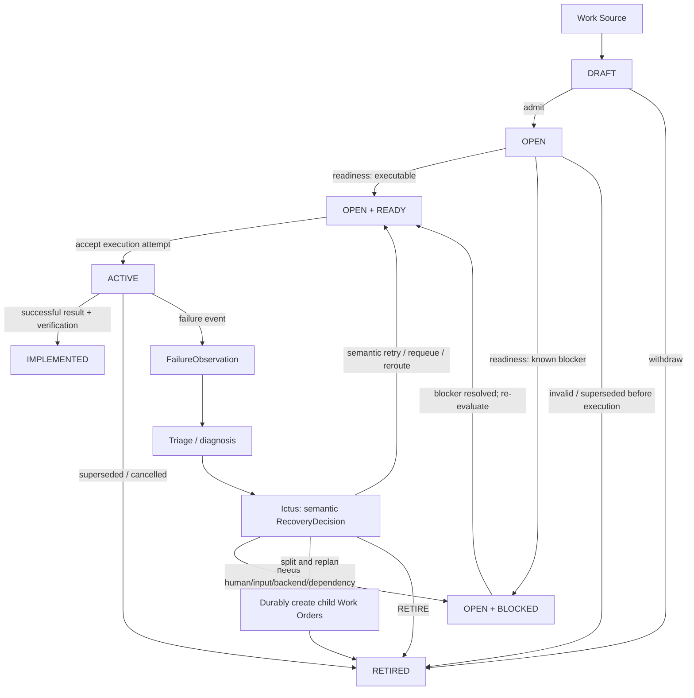

# Tactus Control-Plane Architecture — Whiteboard Translation

This document translates the hand-drawn control-plane design into a versioned architecture description. It is a design source of truth, not an implementation claim.

The original hand-drawn sketch is preserved as a **non-authoritative reference
artifact** at [`whiteboard-original.jpg`](whiteboard-original.jpg). This Markdown
document — not the image — is the authoritative architecture specification.

The sketch focuses on five connected concerns:

1. Work Order lifecycle and state ownership.
2. Blocking and unblocking.
3. Admission/eligibility, semantic backend routing, and execution handoff.
4. Triage and recovery decisions after failures.
5. Human intervention for cases automation cannot resolve safely.

The design must remain consistent with the wider Tactus architecture:

```text
CONTROL PLANE
Tactus
   ↓
DECISION PLANE
Ictus
   ↓
EXECUTION / PROVENANCE PLANE
Dagster + Metaxy
   ↓
RUNTIME / SANDBOX PLANE
SandboxRuntime       AgentRuntime
OpenShell / ...      Pi / SoL-Pi / ...
   ↓
CAPABILITIES
Git + Stax
shell / tests / build / deploy / ...
```

## Responsibility split

The canonical ownership table is:

```text
Tactus
= WorkOrder/domain lifecycle
= domain dependencies/readiness
= admission/eligibility
= domain facts/context
= application of validated semantic decisions
= human/domain coordination

Ictus
= semantic decision making
= policy
= capability validation
= semantic routing
= recovery strategy

Dagster
= temporal/durable execution
= workflow graph
= run/step state
= schedules
= sensors/events
= run queue
= execution concurrency
= retries
= re-execution
= execution history
= execution observability
```

Load-bearing distinctions:

```text
domain dependency      ≠ Dagster step dependency
domain readiness       ≠ execution scheduling
semantic retry         ≠ Dagster RetryPolicy
backend routing policy ≠ Dagster worker scheduling
ACTIVE                 ≠ "CPU currently running"
```

**Tactus must never become a workflow engine, run queue, temporal scheduler or
retry engine.** Dagster is authoritative over temporal execution state. Ictus is
authoritative over semantic recovery/routing decisions. Tactus is authoritative
over WorkOrder/domain state.

> `WorkOrder.ACTIVE` means an authoritative execution attempt exists / has been
> accepted for execution. It does **not** mirror Dagster's internal
> queued/running step state.

### Tactus

Tactus owns domain coordination:

- Work Order identity and domain lifecycle state (sole authority);
- domain dependency readiness;
- admission/eligibility of admitted work;
- blocked/unblocked status of an `OPEN` Work Order;
- domain facts/context;
- application of validated semantic decisions;
- human/domain coordination and the human-intervention queue;
- orchestration-level observability.

Normative ownership rules:

```text
Tactus
- sole authority over WorkOrder/domain lifecycle state
- owns domain dependencies and OPEN readiness/blocking status
- owns admission/eligibility
- records/normalizes FailureObservations as domain facts
- applies validated semantic RecoveryDecisions
- owns no run queue, schedules, execution concurrency or retry engine
```

### Ictus

Ictus owns semantic decisions and policy:

- classify an observation/failure into a bounded diagnosis;
- choose a typed recovery action;
- semantic routing, including backend routing policy;
- capability and policy validation;
- approval requirements;
- recovery strategy;
- emit validated execution intents.

```text
Ictus
- owns diagnosis, policy, semantic routing and typed RecoveryDecisions
- authoritative over semantic recovery/routing decisions
- consumes normalized observations from Tactus
- does NOT directly mutate WorkOrder state
```

Tactus must not bury recovery or routing policy in ad-hoc scheduler branches.
Ictus must not become an execution scheduler, run queue or durable workflow
engine.

### Dagster

Dagster owns temporal/durable execution and is authoritative over temporal
execution state:

- workflow graph;
- runs and steps, and their persistence;
- schedules and sensors/events;
- run queue and execution concurrency;
- retries (`RetryPolicy`) and re-execution mechanics;
- persistence of execution history;
- execution dependencies;
- execution observability.

```text
Dagster
- owns temporal/durable execution mechanics and temporal execution state
- reports execution outcomes/errors
- does NOT own or mutate Tactus WorkOrder state
```

Tactus does not mirror Dagster's queued/running step state; `WorkOrder.ACTIVE`
records only that an authoritative execution attempt has been accepted.

### Metaxy

Metaxy is interwoven with Dagster where data/artifact lineage is relevant. It does not replace Tactus lifecycle/audit state and is not required for every software-engineering Work Order.

### Runtime plane

The runtime plane supplies replaceable `SandboxRuntime` and `AgentRuntime` implementations. Runtime choice must not change Tactus lifecycle semantics.

## Core control loop



The diagram intentionally treats **retry as an action**, not as a permanent lifecycle state. A semantic retry/requeue decision returns the Work Order to `OPEN + READY` and creates a new execution attempt; it is distinct from Dagster's execution-level `RetryPolicy`. The `OPEN + READY` and `OPEN + BLOCKED` nodes are **readiness statuses of the `OPEN` lifecycle state**, not peer lifecycle states. A failure event creates a `FailureObservation` while the Work Order remains `ACTIVE`; failure never becomes a lifecycle state. Successful completion does **not** pass through Ictus recovery: `ACTIVE → IMPLEMENTED` is a direct, independent outcome, and `IMPLEMENTED` / `RETIRED` are terminal.

## Canonical lifecycle states

The Work Order lifecycle is exactly:

```text
DRAFT | OPEN | ACTIVE | IMPLEMENTED | RETIRED
```

| Lifecycle state | Meaning |
|---|---|
| `DRAFT` | Work exists but is not yet admitted for execution. |
| `OPEN` | Work has been admitted; readiness is tracked separately as `READY` or `BLOCKED`. |
| `ACTIVE` | An authoritative execution attempt exists / has been accepted for execution. It does not mirror Dagster's internal queued/running step state. |
| `IMPLEMENTED` | The requested outcome passed required verification (whiteboard term: `IMPLEMENTED`). |
| `RETIRED` | Work is intentionally no longer executable, for example because it is superseded, invalidated, or replaced by split child work. |

`IMPLEMENTED` and `RETIRED` are terminal.

### OPEN readiness status (orthogonal, not lifecycle states)

While the lifecycle state is `OPEN`, the Work Order carries one readiness status:

| Readiness status | Meaning |
|---|---|
| `READY` | Work is executable and waiting for admission/eligibility (not for a Dagster worker). |
| `BLOCKED` | Work cannot currently progress because a typed blocker exists. |

`READY` and `BLOCKED` are **not** peer lifecycle states. A readiness change is
**not** a lifecycle transition, and a resolved blocker must trigger
re-evaluation rather than blindly assigning `READY`.

### Failure is an observation, not a state

A failure that occurs while a Work Order is `ACTIVE` produces a
`FailureObservation` while the Work Order remains `ACTIVE`:

```text
ACTIVE
  ↓ failure event
FailureObservation
  ↓
Triage / Ictus RecoveryDecision
  ↓
Tactus applies the decision
```

There is no `FAILED` / `FAIL` Work Order lifecycle state.

## Supporting architecture documents

- [`WORK_ORDER_LIFECYCLE.md`](WORK_ORDER_LIFECYCLE.md)
- [`SCHEDULING_AND_BACKENDS.md`](SCHEDULING_AND_BACKENDS.md)
- [`TRIAGE_AND_RECOVERY.md`](TRIAGE_AND_RECOVERY.md)
- [`HUMAN_INTERVENTION.md`](HUMAN_INTERVENTION.md)
- [`../ROADMAP.md`](../ROADMAP.md)

## Design rules extracted from the sketch

1. **Lifecycle state, readiness status, observations, and recovery actions are different concepts.** `READY`/`BLOCKED` are `OPEN` readiness statuses; `FailureObservation` is an event attached to an `ACTIVE` Work Order; `RETRY`, `REQUEUE`, `REROUTE`, `SPLIT_REPLAN`, and `ESCALATE_HUMAN` are actions/decisions. None of them are lifecycle states.
2. **`READY` means executable but waiting for admission/eligibility.** Lack of execution concurrency (a Dagster-owned concern) keeps a Work Order `OPEN + READY`; it is not a blocker and does not mirror Dagster's run queue.
3. **`BLOCKED` is an `OPEN` readiness status and always carries a typed reason.** The status alone is insufficient.
4. **Backend health is system state, not Work Order truth.** A Work Order may be reroutable when one backend fails.
5. **Triage produces a diagnosis plus a typed decision.** The decision then maps to an existing lifecycle transition and optional additional action.
6. **Human intervention uses the same typed action model as automation.** Humans do not directly mutate arbitrary state.
7. **Semantic retries are distinct from execution retries.** Recovery actions are bounded Ictus decisions; Dagster's `RetryPolicy` is separate execution-level mechanics. Tactus owns neither a retry engine nor a run queue.
8. **Split-and-replan replaces the original execution unit with smaller children.** The parent retains provenance and becomes non-executable when the children take over.
9. **Failure does not transition the Work Order.** It remains `ACTIVE` until Tactus applies the resulting recovery decision or accepts successful completion.

## Open questions to resolve during implementation

The hand-drawn design intentionally leaves several choices open. They should become explicit ADRs or issue decisions rather than being guessed in code:

- Which block reasons are top-level reasons versus sub-reasons?
- Which backend health signals are authoritative and how long do they remain valid?
- Which failures permit a same-backend retry before requeue/reroute?
- What is the exact retry budget hierarchy: per attempt, per diagnosis, per Work Order, per backend?
- Which human actions require Ictus policy validation/approval before Tactus applies them?

Do not silently resolve these by copying Fleet v3 behavior. Tactus should preserve the useful semantics while establishing simpler, explicit contracts.
