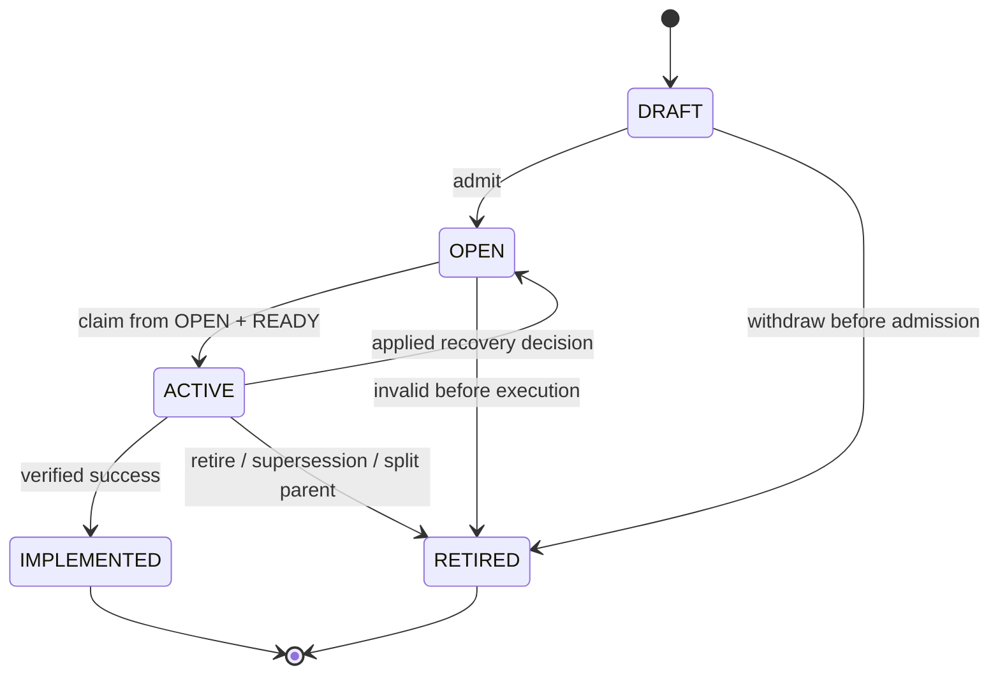
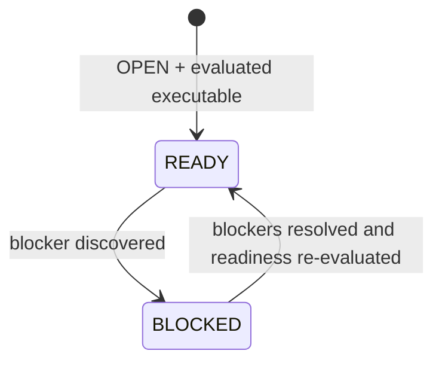

# Work Order Lifecycle

## Purpose

Tactus owns the lifecycle of a Work Order. The lifecycle describes **whether the requested unit of work can progress**, not how a particular worker/backend attempt is internally implemented.

The model deliberately keeps four dimensions separate:

1. **Lifecycle state** — the small, single-valued state owned by Tactus.
2. **OPEN readiness/blocking status** — whether an `OPEN` Work Order is currently executable.
3. **Failure observations** — events attached to an `ACTIVE` Work Order when an execution attempt fails.
4. **Diagnosis and recovery decisions** — Ictus-owned, applied by Tactus as lifecycle transitions.

Keeping these dimensions separate prevents lifecycle-state explosion such as
`FAILED`, `FAIL`, `RETRYING`, `SUCCEEDED`, `PENDING`, or `RUNNING`.

## Lifecycle states

The Work Order lifecycle has exactly five states:

```text
DRAFT | OPEN | ACTIVE | IMPLEMENTED | RETIRED
```



`READY`, `BLOCKED`, and `FAIL` are **not** lifecycle states. `READY` and
`BLOCKED` are readiness statuses of an `OPEN` Work Order (see
[OPEN readiness status](#open-readiness-status)). Failure is an observation, not
a state (see [Failure is not a lifecycle state](#failure-is-not-a-lifecycle-state)).

### `DRAFT`

The Work Order exists, but the system has not yet admitted it for execution.

Typical reasons to remain draft:

- incomplete specification;
- not yet approved as collaborative/executable work;
- created by a human or WorkSource but not yet admitted.

### `OPEN`

The Work Order has been admitted. Tactus evaluates whether it is executable.

While `OPEN`, the Work Order also carries a readiness status of `READY` or
`BLOCKED`. `OPEN` should not become a generic waiting room. Once Tactus can
determine readiness, it should mark the Work Order `READY` or `BLOCKED`; the
lifecycle state remains `OPEN`.

Checks may include:

- schema/contract validity;
- project/repository identity;
- prerequisite Work Orders;
- required input/artifact availability;
- policy prerequisites;
- dependency readiness.

### `ACTIVE`

An execution attempt currently owns the Work Order through the scheduler/lease mechanism.

`ACTIVE` must correspond to at most one authoritative active execution attempt
unless the Work Order explicitly supports planned parallel child execution.

A failed execution attempt does **not** change the lifecycle state. Tactus records
a `FailureObservation` while the Work Order stays `ACTIVE` until a recovery
decision is applied.

### `IMPLEMENTED`

The requested outcome has been implemented and passed the required verification.

The whiteboard term is `IMPLEMENTED`. This is the normal success terminal state.
It means the Work Order's requested outcome is accepted by the Tactus control
plane. It does not automatically mean deployment, publication, or merge unless
the Work Order explicitly models such a capability.

### `RETIRED`

The Work Order is intentionally no longer executable.

Examples:

- superseded by newer work;
- request is no longer valid;
- replaced by split/replanned child Work Orders;
- explicitly withdrawn or cancelled after supersession.

Retirement is not failure.

## OPEN readiness status

Readiness is orthogonal to lifecycle state. It is meaningful only while the
Work Order lifecycle state is `OPEN`:

```text
OPEN
├── READY
└── BLOCKED
```



A readiness change is **not** a lifecycle transition. `READY`/`BLOCKED` are
never peers of `DRAFT`/`OPEN`/`ACTIVE`/`IMPLEMENTED`/`RETIRED`.

### `READY` (OPEN)

The Work Order is executable and is waiting for scheduling.

`READY` does **not** mean a worker is currently available.

A Work Order remains `READY` while waiting for:

- global concurrency capacity;
- per-project capacity;
- backend-compatible worker capacity;
- scheduler selection.

A pure capacity wait is not a blocker.

### `BLOCKED` (OPEN)

The Work Order cannot currently make progress because a typed blocker exists.

A blocked record must contain at least:

```text
reason
subreason (optional)
evidence / context
blocked_at
resolution condition or required action where known
```

Initial top-level block reasons:

```text
DEPENDENCY
BACKEND_UNAVAILABLE
HUMAN_INPUT_REQUIRED
INTEGRATION_BLOCKED
DELIVERY_BLOCKED
OTHER
```

Potential `HUMAN_INPUT_REQUIRED` sub-reasons:

```text
APPROVAL_REQUIRED
CLARIFICATION_REQUIRED
SECRET_REQUIRED
EXTERNAL_INPUT_REQUIRED
MANUAL_SELECTION_REQUIRED
OTHER
```

A backend being busy is **not** `BACKEND_UNAVAILABLE`; busy/capacity-constrained work stays `READY`.

### Resolving a blocker

A blocker being resolved must cause readiness to be **re-evaluated**. It does not
blindly assign `READY`:

```text
OPEN + BLOCKED
   ↓ blocker resolved
re-evaluate all blockers and prerequisites
   ├── no blocker remains → OPEN + READY
   └── another blocker remains → OPEN + BLOCKED (remaining reason)
```

## Failure is not a lifecycle state

When an execution attempt fails, Tactus normalizes the outcome into a
`FailureObservation` attached to the `ACTIVE` Work Order:

```text
ACTIVE
  ↓ failure event
FailureObservation
  ↓
Triage / Ictus RecoveryDecision
  ↓
Tactus applies decision
```

A failure does not transition the Work Order into a `FAILED` lifecycle state.
The Work Order remains `ACTIVE` until Tactus applies the resulting recovery
decision or successful completion is accepted.

A `FailureObservation` is an event/domain observation attached to an `ACTIVE`
Work Order. It is not an `ACTIVE` substate and not a Work Order lifecycle state.

The observation vocabulary, diagnosis taxonomy, and recovery decisions live in
[`TRIAGE_AND_RECOVERY.md`](TRIAGE_AND_RECOVERY.md).

## Recovery outcome transitions

A recovery decision does not invent new lifecycle states. Applying a validated
decision produces one of the existing lifecycle states:

```text
ACTIVE
  ↓ RETRY / REQUEUE / REROUTE / REPAIR_AND_RETRY
OPEN + READY
```

```text
ACTIVE
  ↓ BLOCK / ESCALATE_HUMAN
OPEN + BLOCKED
```

```text
ACTIVE
  ↓ RETIRE
RETIRED
```

```text
ACTIVE
  ↓ successful implementation + verification
IMPLEMENTED
```

For split/replan, the parent is retired only after child creation succeeds
durably (see [Parent/child semantics](#parentchild-semantics)).

## Legal lifecycle transitions

| Transition | Trigger | Authority |
|---|---|---|
| `DRAFT → OPEN` | Admission | Tactus (human/WorkSource triggered) |
| `DRAFT → RETIRED` | Withdraw before admission | Tactus |
| `OPEN → ACTIVE` | Claim from `OPEN + READY` | Tactus scheduler |
| `OPEN → RETIRED` | Invalidated/superseded before execution | Tactus |
| `ACTIVE → IMPLEMENTED` | Successful implementation + verification | Tactus (on Dagster outcome + verification) |
| `ACTIVE → OPEN` | Applied recovery decision | Tactus applies Ictus decision |
| `ACTIVE → RETIRED` | Applied `RETIRE` / supersession / split parent | Tactus |
| `IMPLEMENTED` | Terminal | — |
| `RETIRED` | Terminal | — |

Rule: `OPEN → ACTIVE` is legal **only** when `OPEN + READY` is successfully
claimed. `ACTIVE → OPEN` is legal **only** through an applied recovery decision;
the resulting OPEN readiness is `READY` or `BLOCKED`.

## Readiness changes (not lifecycle transitions)

| Change | Trigger |
|---|---|
| `OPEN + READY → OPEN + BLOCKED` | Blocker discovered |
| `OPEN + BLOCKED → OPEN + READY` | Blocker resolved and readiness re-evaluated |
| `OPEN + BLOCKED → OPEN + BLOCKED` | A blocker resolved but another remains |

Do not create extra states merely to represent intermediate implementation
operations.

## Transition authority

Tactus owns lifecycle transitions, but the trigger may come from different
planes:

| Transition | Typical trigger |
|---|---|
| `DRAFT → OPEN` | Human/WorkSource admission |
| `DRAFT → RETIRED` | Withdraw before admission |
| `OPEN → ACTIVE` | Scheduler claim from `OPEN + READY` |
| `OPEN → RETIRED` | Supersession/invalidity before execution |
| `ACTIVE → IMPLEMENTED` | Dagster execution result + verification |
| `ACTIVE → OPEN` | Applied recovery decision (readiness re-evaluated) |
| `ACTIVE → RETIRED` | Applied `RETIRE` decision / supersession / split parent |

## Ownership rules

These are normative.

```text
Tactus
- sole authority over WorkOrder lifecycle state
- owns OPEN readiness/blocking status
- records/normalizes FailureObservations
- applies validated RecoveryDecisions

Dagster
- owns durable execution mechanics
- reports execution outcomes/errors
- does NOT own or mutate Tactus WorkOrder state

Ictus
- owns diagnosis, policy and typed RecoveryDecisions
- consumes normalized observations from Tactus
- does NOT directly mutate WorkOrder state
```

The intended control flow is therefore:

```text
TACTUS
WorkOrder = ACTIVE
      │
      │ execution
      ▼
DAGSTER
execution outcome / error
      │
      ▼
TACTUS ADAPTER
normalize into FailureObservation
      │
      ▼
TACTUS
WorkOrder still ACTIVE
      │
      ▼
ICTUS
Diagnosis + RecoveryDecision
      │
      ▼
TACTUS
apply decision
      │
      ├── OPEN + READY
      ├── OPEN + BLOCKED
      ├── RETIRED
      └── IMPLEMENTED only on successful completion path
```

## Retry is not a lifecycle state

A retry is an **action** that creates another execution attempt.

Conceptually:

```text
ACTIVE
  ↓ failure observation
Ictus: RETRY / REQUEUE_READY
  ↓ decision applied
OPEN + READY
  ↓ scheduler
ACTIVE (new attempt)
```

This prevents lifecycle-state explosion such as `RETRYING`, `RETRY_2`,
`RECOVERY_READY`, etc.

## Parent/child semantics

When work is split:

```text
Parent WO (ACTIVE)
   ↓ SPLIT_REPLAN
Child A  Child B  Child C
```

The parent remains the provenance root. Once child creation is durably
committed, the parent becomes non-executable (normally `RETIRED`) and carries
explicit links to its children.

Children independently enter `OPEN` (with `READY`/`BLOCKED` readiness) according
to their prerequisites.
