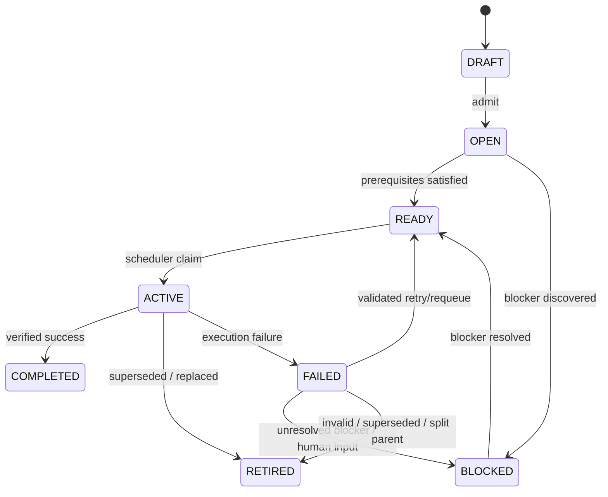

# Work Order Lifecycle

## Purpose

Tactus owns the lifecycle of a Work Order. The lifecycle describes **whether the requested unit of work can progress**, not how a particular worker/backend attempt is internally implemented.

The initial lifecycle is deliberately small:



## State semantics

### `DRAFT`

The Work Order exists, but the system has not yet admitted it for execution.

Typical reasons to remain draft:

- incomplete specification;
- not yet approved as collaborative/executable work;
- created by a human or WorkSource but not yet admitted.

### `OPEN`

The Work Order has been admitted. Tactus evaluates whether it can become executable.

Checks may include:

- schema/contract validity;
- project/repository identity;
- prerequisite Work Orders;
- required input/artifact availability;
- policy prerequisites;
- dependency readiness.

`OPEN` should not become a generic waiting room. Once Tactus can determine readiness, it should move to `READY` or `BLOCKED`.

### `READY`

The Work Order is executable and is waiting for scheduling.

`READY` does **not** mean a worker is currently available.

A Work Order remains `READY` while waiting for:

- global concurrency capacity;
- per-project capacity;
- backend-compatible worker capacity;
- scheduler selection.

A pure capacity wait is not a blocker.

### `ACTIVE`

An execution attempt currently owns the Work Order through the scheduler/lease mechanism.

`ACTIVE` must correspond to at most one authoritative active execution attempt unless the Work Order explicitly supports planned parallel child execution.

### `BLOCKED`

The Work Order cannot currently make progress because a typed blocker exists.

A blocked record must contain at least:

```text
reason
subreason (optional)
evidence / context
blocked_at
resolution condition or required action where known
```

Initial top-level block reasons:

```text
DEPENDENCY
BACKEND_UNAVAILABLE
HUMAN_INPUT_REQUIRED
INTEGRATION_BLOCKED
DELIVERY_BLOCKED
OTHER
```

Potential `HUMAN_INPUT_REQUIRED` sub-reasons:

```text
APPROVAL_REQUIRED
CLARIFICATION_REQUIRED
SECRET_REQUIRED
EXTERNAL_INPUT_REQUIRED
MANUAL_SELECTION_REQUIRED
OTHER
```

A backend being busy is **not** `BACKEND_UNAVAILABLE`; busy/capacity-constrained work stays `READY`.

### `FAILED`

The latest execution attempt ended unsuccessfully and the result requires diagnosis/decision.

`FAILED` must never itself encode the recovery strategy. Recovery is represented separately as a typed decision.

Possible future simplification: model failure only as an `ExecutionResult` and immediately enter recovery decision processing rather than persisting `FAILED` as a long-lived Work Order state. Keep this open until the first implementation slice proves the need.

### `COMPLETED`

The requested outcome has completed and passed required verification.

`COMPLETED` means the Work Order's requested outcome is accepted by the Tactus control plane. It does not automatically mean deployment, publication, or merge unless the Work Order explicitly models such a capability.

### `RETIRED`

The Work Order is intentionally no longer executable.

Examples:

- superseded by newer work;
- request is no longer valid;
- replaced by split/replanned child Work Orders;
- explicitly withdrawn.

Retirement is not failure.

## Transition authority

Tactus owns lifecycle transitions, but the trigger may come from different planes:

| Transition | Typical trigger |
|---|---|
| `DRAFT → OPEN` | Human/WorkSource admission |
| `OPEN → READY` | Tactus readiness evaluation |
| `OPEN → BLOCKED` | Tactus prerequisite/blocker evaluation |
| `BLOCKED → READY` | Resolution event / validated operator action |
| `READY → ACTIVE` | Scheduler claim |
| `ACTIVE → COMPLETED` | Dagster execution result + verification |
| `ACTIVE → FAILED` | Dagster execution failure result |
| `FAILED → READY/BLOCKED/RETIRED` | Ictus recovery decision applied by Tactus |
| `ACTIVE → RETIRED` | explicit supersession/cancellation policy |

## Retry is not a lifecycle state

A retry is an **action** that creates another execution attempt.

Conceptually:

```text
FAILED
  ↓
Ictus: RETRY / REQUEUE_READY
  ↓
READY
  ↓
Scheduler
  ↓
ACTIVE (new attempt)
```

This prevents lifecycle-state explosion such as `RETRYING`, `RETRY_2`, `RECOVERY_READY`, etc.

## Parent/child semantics

When work is split:

```text
Parent WO
   ↓ SPLIT_REPLAN
Child A  Child B  Child C
```

The parent remains the provenance root. Once child creation is durably committed, the parent should become non-executable (normally `RETIRED`) and carry explicit links to its children.

Children independently enter `OPEN`/`READY` according to their prerequisites.
