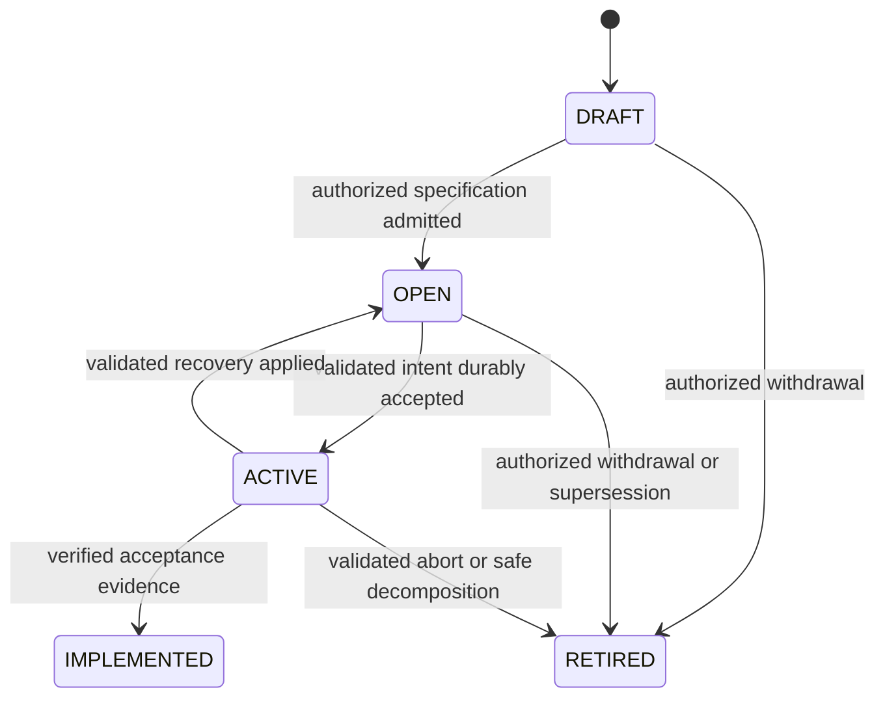

# WorkOrder state model

Normative part of [Architecture Baseline v1](SYSTEM_ARCHITECTURE.md).

Keep the implemented five-state lifecycle:

`OPEN` has orthogonal readiness `UNKNOWN | READY | BLOCKED`. UNKNOWN is not
executable. Readiness combines prerequisites, holds and applicable domain
conditions. Resolving one blocker never clears unrelated blockers. Blockers have
typed reason, evidence, creation/update time and explicit resolution condition.
Examples: dependency, required human input, no authorized backend, source changed,
integration/delivery condition. Busy Dagster execution capacity is not a domain
blocker.

Failure is an observation while ACTIVE, not a lifecycle state. ACTIVE means a
Tactus-authorized attempt has been durably accepted for dispatch, including
pending submission, Dagster queue time and execution. It does not mean a CPU is
running. Before validated intent acceptance, a short coordination claim leaves
the WorkOrder OPEN; it is not permission to start a worker.

## Durable invariants

1. At most one unclosed semantic attempt per WorkOrder, enforced transactionally.
2. A coordination claim has owner, expiry, monotonic fencing token and expected
   WorkOrder revision. Lease expiry permits coordination recovery, never an
   automatic replacement of possibly running work.
3. Commit intent acceptance, ACTIVE transition, semantic attempt, source revision
   and submission record together. Dagster run ID may be attached later; current
   code requiring it at admission is a migration seam.
4. Record every result/decision application once with stable identity. Close the
   prior attempt and apply its domain outcome in the same transaction.
5. Reopening invalidates earlier eligibility; recompute prerequisites before the
   next admission. New intent requires current context and approval binding.
6. Human requests and grants survive restarts. A resolution is an authenticated
   typed command, not an unstructured message or implicit unconditional approval.
7. A cancelled or superseded prerequisite does not automatically satisfy a
   dependent. Dependency rewrites are cycle-checked and preserve provenance.

## Decomposition

Ictus produces a validated DECOMPOSE decision (domain meaning SPLIT_REPLAN) and
bounded plan. Tactus checks subject/revision, scope authorization, child limits,
unique identities, cycles and downstream satisfaction mapping. It commits child
WorkOrders, parent-child lineage, dependency rewrite and parent retirement
atomically. On any failure the parent remains authoritative and no partial
children become executable. Replaying the same decision returns the same children.
Children inherit issue provenance and require their own readiness/admission.

## Completion and publication

IMPLEMENTED requires the WorkOrder's recorded acceptance condition and verified
evidence. For M2 that is a deterministic local capability result. For software
work the specification must say whether verified change, opened PR or merged PR
is required. Default M3 implementation completion means verified proposed change;
publication/merge are separately authorized effects unless explicitly required.
Never close a GitHub Issue simply because one derived WorkOrder finished: all
issue acceptance criteria and required PR reviews must be satisfied.

Pause prevents new intent acceptance; cancelling queued/running work is a
separate authorized operation. Cancellation remains pending until the execution
plane and actual runtime acknowledge termination or an operator resolves unknown
state. Unknown execution never authorizes an overlapping replacement writer.
